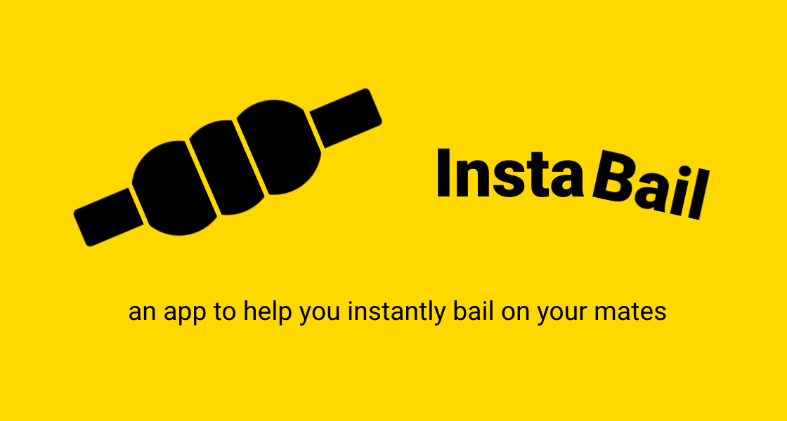

# [InstaBail](https://instabail.uk/)

This project is treeware! If you found it entertaining then please [plant a tree for me](https://offset.earth/unitsetsoftware).

## An app to help you instantly bail on your mates

Visit [instabail.uk](https://instabail.uk/).

InstaBail is a fun offline mobile progressive web app (PWA) that generates random excuses (bails) and easily lets you share them. It uses real-time train delay information for more realistic bails.
InstaBail uses the TfL API and my [Huxley project](https://github.com/jpsingleton/Huxley) to proxy live railway departure data.

You can add this app to your phone's home screen. Simply press the share/menu button in the browser toolbar then press "Add to Home Screen". If you launch the app from there it will run full screen. It even works offline (but you won't get all the bails without internet).

If you like, you can read my blog at [unop.uk](https://unop.uk/) and follow [me on Twitter](https://twitter.com/shutdownscanner).
I'm also [available for hire](https://unop.uk/hire-me/) and you may enjoy reading [my book on high performance web apps](https://unop.uk/book/).
